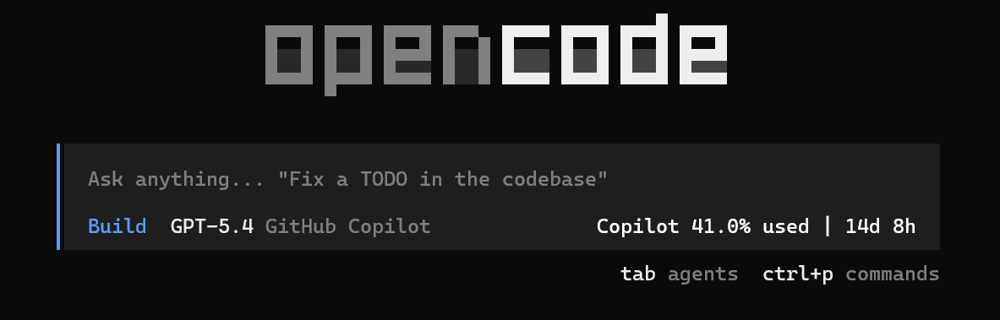

# opencode-copilot-quota-status

OpenCode TUI plugin that shows live GitHub Copilot quota usage in the prompt status area.

It reads your existing OpenCode GitHub Copilot authentication and renders a live status like:

```text
Copilot 39.7% used | 14d 8h
```



## Features

- Uses live GitHub Copilot quota data
- Shows percentage used instead of remaining requests
- Refreshes automatically every 60 seconds
- Refreshes again when OpenCode reconnects to the server
- Renders in both home and session prompt status areas

## Install

This plugin is a TUI plugin.

Use `~/.config/opencode/tui.json`, not `~/.config/opencode/opencode.json`.

### Install from npm

1. Publish the package to npm.
2. Open or create `~/.config/opencode/tui.json`.
3. Add the package name to the `plugin` array.
4. Restart OpenCode.

Example `~/.config/opencode/tui.json`:

```json
{
  "$schema": "https://opencode.ai/tui.json",
  "plugin": ["opencode-copilot-quota-status"]
}
```

### Install from a local folder

If you want to use this repo directly before publishing:

1. Clone or copy this project anywhere on your machine.
2. Build it:

```bash
npm install
npm run build
```

3. Open or create `~/.config/opencode/tui.json`.
4. Add the absolute path to the project folder to the `plugin` array.
5. Restart OpenCode.

Example `~/.config/opencode/tui.json`:

```json
{
  "$schema": "https://opencode.ai/tui.json",
  "plugin": [
    "/home/pavel/projects/opencode-copilot-quota-status"
  ]
}
```

OpenCode will load the plugin from that folder.

## Authentication

The plugin reads GitHub Copilot auth from:

```text
~/.local/share/opencode/auth.json
```

Optional manual billing config can be provided at:

```text
~/.config/opencode/copilot-quota-token.json
```

## Local development

```bash
npm install
npm run build
```

Then point `~/.config/opencode/tui.json` at the local package directory while testing.

## Notes

- This is a TUI plugin, not a server plugin.
- It belongs in `tui.json`, not `opencode.json`.
- The plugin shows up near the prompt status row in both the home screen and active sessions.
